# 项目说明

## 一、整体说明

newspage项目使用了vue作为主要的开发技术，vue-router进行了页面管理，vuex进行数据的统一管理

## 二、项目结构

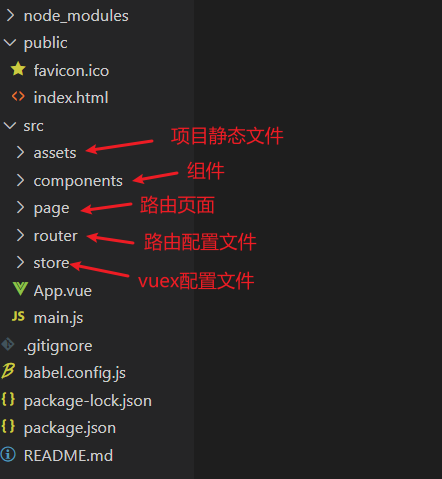

## 三、项目开发步骤

1.   路由配置文件

     配置文件如下，配置了两个路径，`/`为路由主页路径，`/detail`为新闻详情页，核心配置文件如下

     

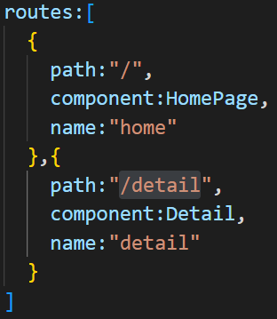

2.   vuex配置文件

     该项目使用vuex进行了统一的新闻数据管理，数据详情如下，由于数据过多，仅展示一部分

     

3.   路由页面配置

     路由页面包括两个文件，`HomePage`为主页路由页面，`Detail`为新闻详情页路由

     *   `HomePage`路由加载注册了`Swipper`轮播图组件，以及`News`新闻列表组件

         *   Swipper实现了图片轮播功能，可进行简单配置

             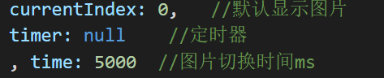

         *   News组件实现了新闻列表页，以及向新闻详情页的路由跳转，为New组件的外层容器

             *   通过计算属性获取全局存储的新闻数据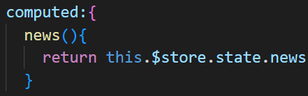

             *   使用v-for生成列表，并向New组件传递数据，绑定点击事件

                 

             *   编写编程式路由导航，通过params向Detail组件传递新闻编号

                 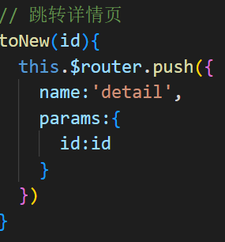

4.   New组件实现

     New组件是对新闻的一个简单展示，效果如下

     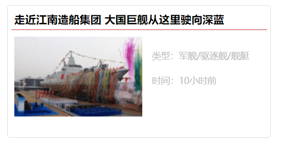

     *   使用props接收父组件传递的值

         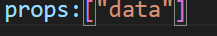

     *   使用模板进行数据渲染

         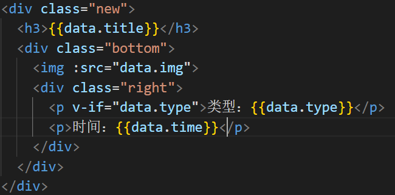

         `v-if`命令判断该数据对象是否含有type属性，没有该属性则不加载该`p`标签

5.   新闻详情页数据展示

     在该页面上进行新闻具体数据的展示，效果如下：

     

     *   获取News组件通过路由传递的id值

         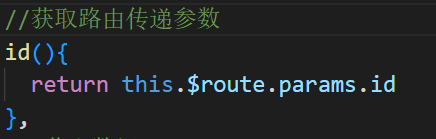

     *   根据id获取对应的新闻数据

         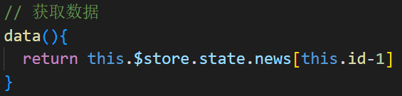

     *   使用模板进行渲染

         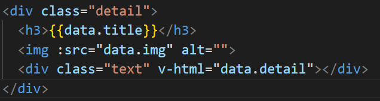

         `v-html`命令将detail下的数据解析为html元素插入